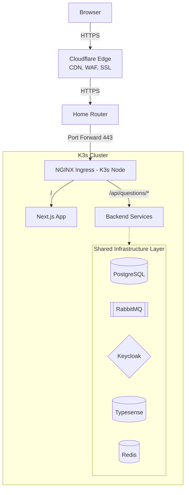
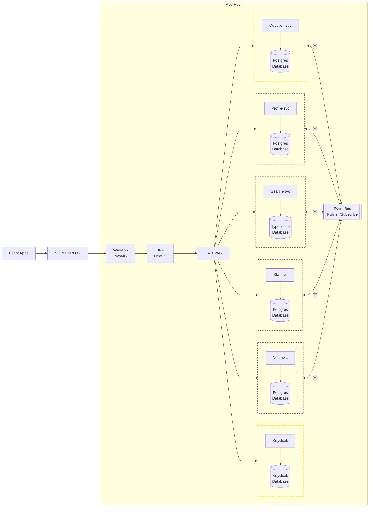
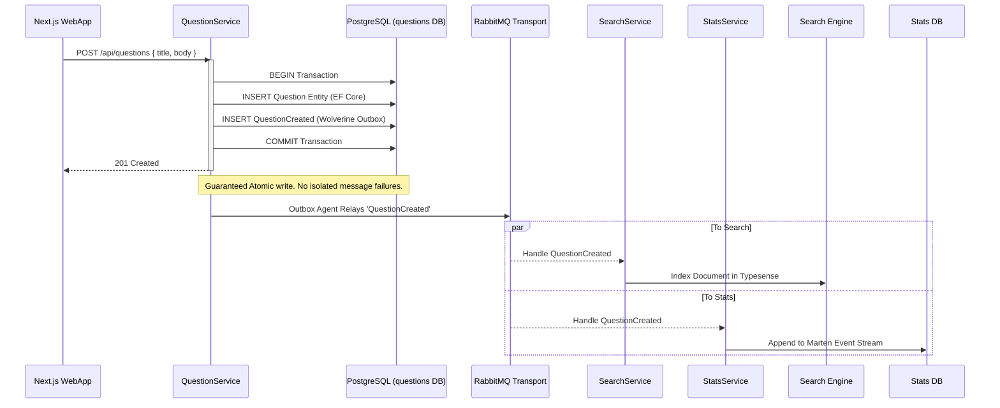
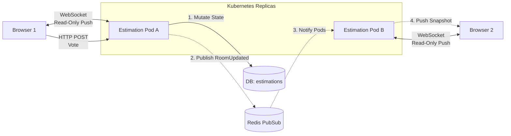
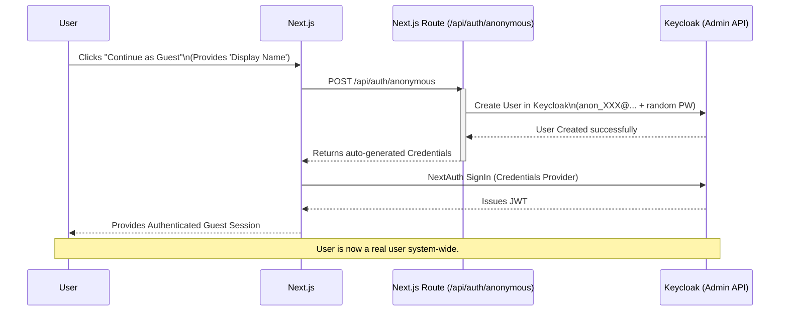
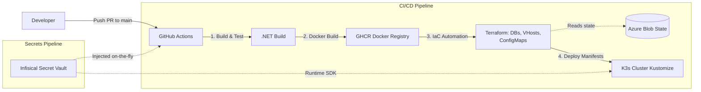

# Overflow Project & Infrastructure Showcase

> **Target Audience:** Technical decision-makers, senior engineers, architects.
> **Focus:** Real-world enterprise engineering practices utilizing schemas instead of massive text blocks to visualize the system.

---

## Slide 1: High-Level Cloud Infrastructure
*Self-hosted K3s cluster behind Cloudflare, routing to discrete microservices.*

---

## Slide 2: Overflow Microservices General Schema
*A Database-per-Service architecture communicating via RabbitMQ and Wolverine.*

*Legend: Solid lines = Synchronous API / Database calls. Dashed lines = Asynchronous RabbitMQ Events.*

---

## Slide 3: Event-Driven Flow & The Durable Outbox
*How the system safely posts a question and avoids data-loss on crashes.*

---

## Slide 4: Real-Time Planning Poker (EstimationService)
*No RabbitMQ used here—state managed via PostgreSQL and cross-pod Redis instances.*

---

## Slide 5: The "Guest Auth" User Lifecycle Flow
*To eliminate dual auth paths (JWT vs cookies), guests are assigned real Keycloak accounts dynamically.*

---

## Slide 6: CI/CD & Terraform Deployment Automations
*A robust path from Git push to Kubernetes orchestration.*

