# EstimationService (Planning Poker)

Real-time Planning Poker estimation rooms with WebSocket push.

---

## Overview

|               |                                                                          |
|---------------|--------------------------------------------------------------------------|
| **Type**      | .NET 10 ASP.NET Core (Controllers + WebSocket endpoint)                  |
| **Database**  | PostgreSQL via EF Core (`estimationDb`)                                  |
| **Cache**     | FusionCache (L1 in-memory + L2 Redis) with Redis backplane               |
| **Real-time** | Raw WebSocket (server → client snapshots) + Redis pub/sub cross-pod sync |
| **Auth**      | Keycloak JWT — guests get real Keycloak accounts automatically           |
| **Port**      | 8080                                                                     |
| **Messaging** | None — no Wolverine or RabbitMQ dependency                               |
| **Scaling**   | Multi-pod safe via Redis-backed distributed cache + cross-pod broadcast  |

---

## Key Features

- **Room creation** — both authenticated users and guests can create rooms with a selected card deck
- **Guest access** — anonymous users provide a display name; the webapp creates a real Keycloak account automatically
  so they participate as fully authenticated users (see "Guest Auth" in `AGENTS.md`)
- **Legacy guest cookie** — `overflow_guest_id` cookie (30-day, HttpOnly) is still supported for backwards compatibility
- **Display name sync** — re-joining a room updates the participant's display name if it changed (e.g. after account
  upgrade)
- **Real-time updates** — WebSocket pushes personalized room snapshots on every state change
- **HTTP-only mutations** — vote, reveal, reset, archive all go through REST endpoints; WebSocket is read-only push
- **Disconnect = leave** — WebSocket close removes the participant from the room and broadcasts updated state
- **Guest-to-account claim** — `POST /estimation/claim-guest` migrates legacy cookie-based guest participation to an
  authenticated user
- **Automatic room cleanup** — archived rooms are permanently deleted after a configurable retention period (default: 30
  days)

---

## Archived Room Cleanup

Archived rooms are **automatically deleted after 30 days** (configurable) to keep storage lean.

| Setting                     | Default | Description                                              |
|-----------------------------|---------|----------------------------------------------------------|
| `RoomCleanup:RetentionDays` | `30`    | Days after archival before a room is permanently deleted |
| `RoomCleanup:IntervalHours` | `24`    | How often the cleanup background job runs                |

Implemented via `ArchivedRoomCleanupService` (`BackgroundService`). On each run it bulk-deletes expired rooms
along with all related votes, round history, and participants. Override via `appsettings.json`, environment
variables, or Infisical (`ROOM_CLEANUP__RETENTION_DAYS`, `ROOM_CLEANUP__INTERVAL_HOURS`).

---

## Caching & Multi-Pod Architecture

The service uses **FusionCache** with Redis as L2 distributed cache and backplane, plus Redis pub/sub for cross-pod
WebSocket broadcast. This enables horizontal scaling with multiple pods.

### Cache Layers

| Layer         | Technology          | Scope      | TTL                                          | Purpose                                         |
|---------------|---------------------|------------|----------------------------------------------|-------------------------------------------------|
| **L1**        | In-memory (per-pod) | Single pod | 30s (rooms), 60s (profiles), 2m (user rooms) | Sub-millisecond reads, zero network hops        |
| **L2**        | Redis (shared)      | All pods   | Same as L1                                   | Shared cache across pods, survives pod restarts |
| **Backplane** | Redis pub/sub       | All pods   | —                                            | L1 cache invalidation propagation across pods   |

### Multi-Pod WebSocket Broadcast

WebSocket connections are local to each pod (in-memory `ConcurrentDictionary`). When a mutation happens on pod A,
all pods must push updates to their local WebSocket connections:

```
Pod A (mutation)                          Pod B (WebSocket connections)
┌─────────────────────┐                   ┌─────────────────────────────┐
│ 1. EF Core → DB     │                   │                             │
│ 2. Cache invalidate │──── Redis ────────│ FusionCache backplane       │
│    (L1 + backplane) │    backplane      │ → evicts local L1 entry     │
│ 3. Publish roomId   │──── Redis ────────│ CrossPodBroadcastService    │
│    to pub/sub       │    pub/sub        │ → receives roomId           │
│ 4. Local broadcast  │                   │ → WebSocketBroadcaster      │
│    (Pod A sockets)  │                   │   loads room (cache/DB)     │
└─────────────────────┘                   │   broadcasts to local WS    │
                                          └─────────────────────────────┘
```

### Key Services

| Service                      | Lifetime           | Purpose                                                                                       |
|------------------------------|--------------------|-----------------------------------------------------------------------------------------------|
| `RoomCacheService`           | Singleton          | Cache-aside reads for rooms + user room lists via FusionCache                                 |
| `CrossPodBroadcastService`   | Singleton (hosted) | Redis pub/sub: publishes room mutations, subscribes on startup to trigger local WS broadcasts |
| `WebSocketBroadcaster`       | Singleton          | Tracks local WebSocket connections, sends viewer-scoped snapshots                             |
| `ArchivedRoomCleanupService` | Singleton (hosted) | Periodically deletes archived rooms past the configured retention period (default: 30 days)   |

### Fail-Safe Behavior

FusionCache provides automatic **fail-safe**: if the database is temporarily unreachable, stale cached data is served
(up to 5 minutes). If Redis is down, the service degrades gracefully to L1-only (in-memory) caching — it never blocks
on Redis unavailability.

---

## Workflow — Sequence Diagrams

### 1. Room Creation

A moderator (authenticated user or guest with auto-created Keycloak account) creates a new room.

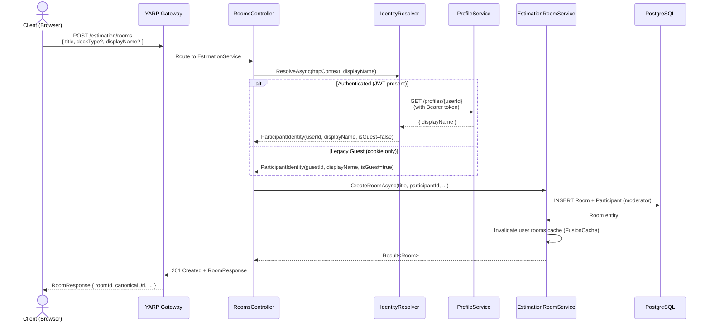

### 2. Join Room + WebSocket Connection

A participant joins an existing room via HTTP, then opens a WebSocket for real-time updates.

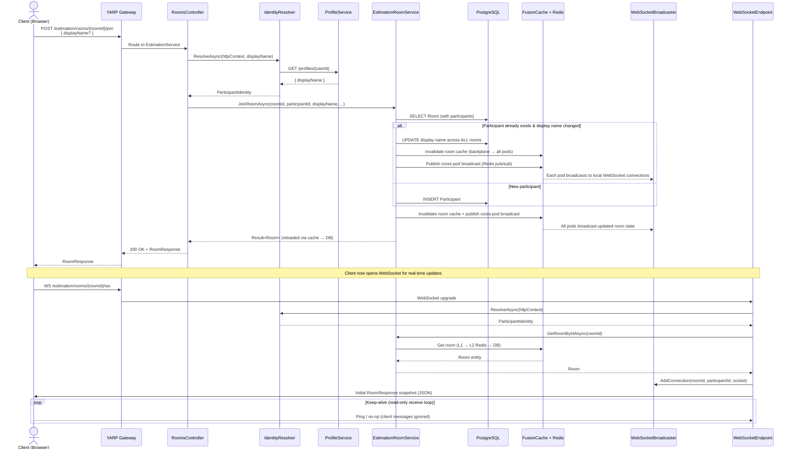

### 3. Voting Round (Submit Vote → Reveal → Reset)

The core estimation flow: participants vote, the moderator reveals results, then optionally starts a new round.

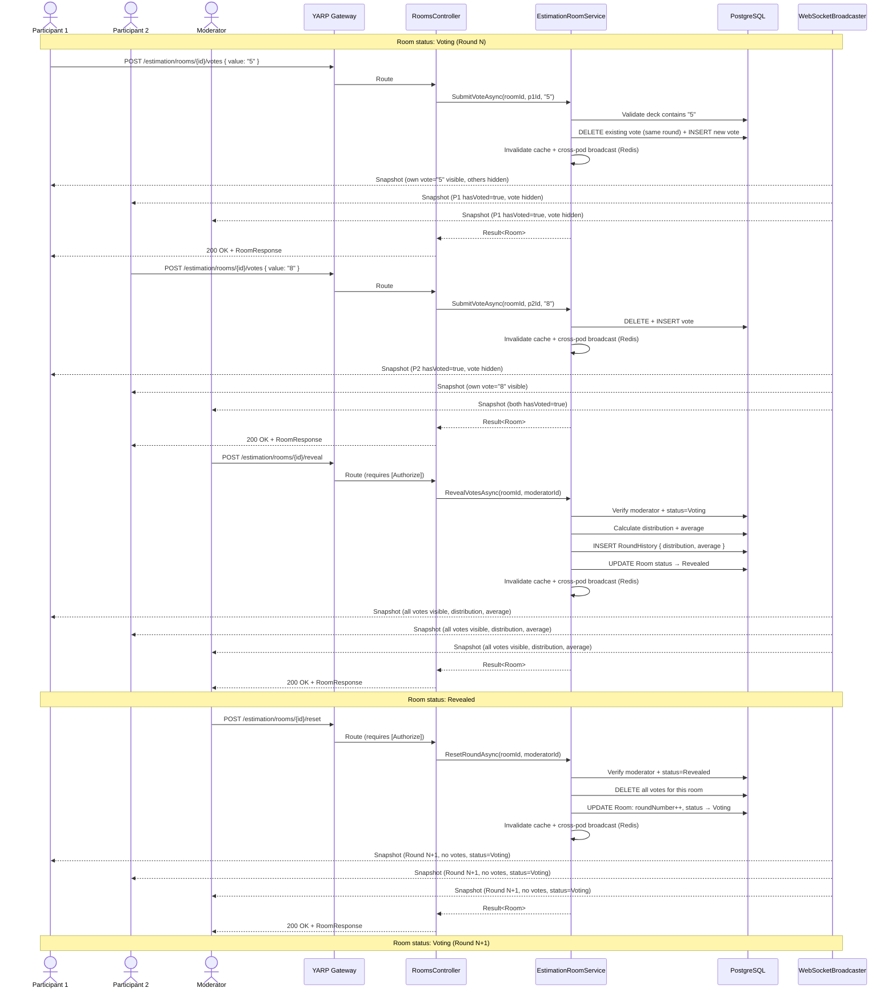

### 4. WebSocket Disconnect (Auto-Leave)

When a participant's WebSocket disconnects, they are automatically removed from the room.

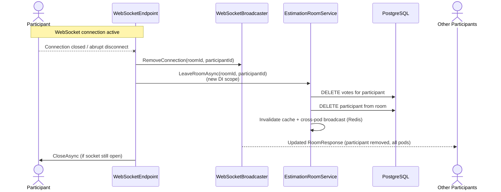

### 5. Spectator Mode Toggle

A participant switches between voter and spectator mode. Switching to spectator clears their current vote.

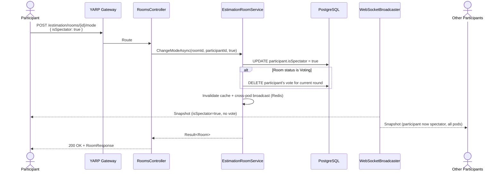

### 6. Room Archival

The moderator permanently closes the room. No further mutations are allowed.

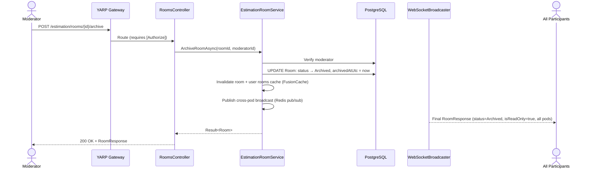

### 7. Legacy Guest Claim (Cookie → Authenticated User)

An authenticated user claims participation history from a legacy guest cookie.

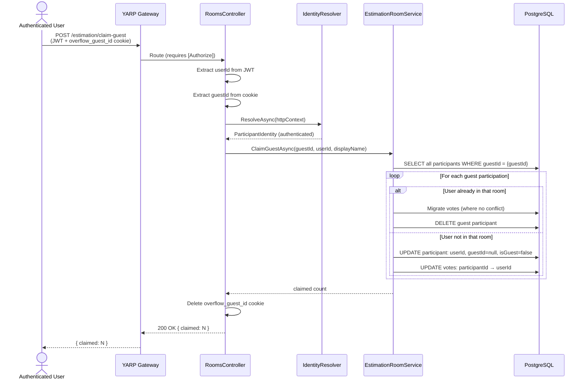

### 8. Clear Vote

A participant retracts their vote during an active voting round.

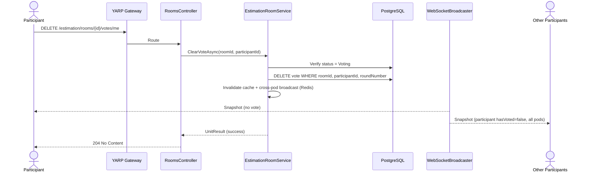

### 9. Refresh Profile (Instant Avatar/Name Push)

After editing their profile or avatar, a user calls this endpoint to push changes to all open rooms instantly.

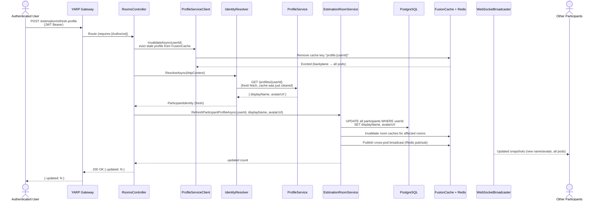

### 10. Full Session Lifecycle (End-to-End)

A complete planning poker session from room creation through multiple rounds to archival.

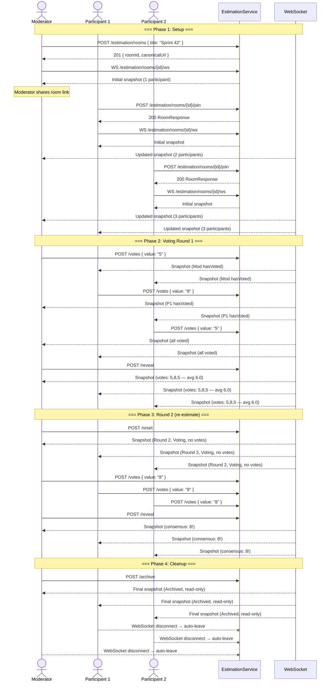

### Room State Machine

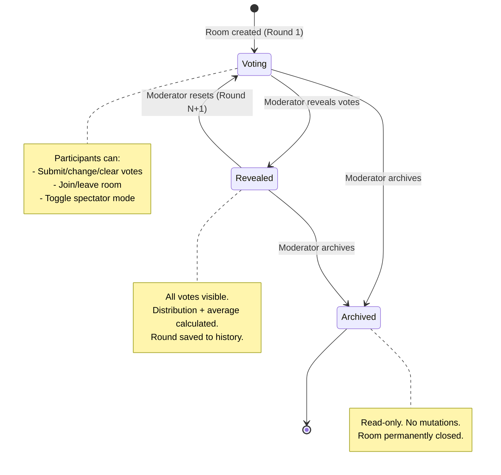

---

## Endpoints

| Method   | Route                             | Auth      | Description                                      |
|----------|-----------------------------------|-----------|--------------------------------------------------|
| `POST`   | `/estimation/rooms`               | Optional  | Create a new room (guests provide `displayName`) |
| `POST`   | `/estimation/rooms/{id}/join`     | Optional  | Join a room (guests provide `displayName`)       |
| `GET`    | `/estimation/rooms/{id}`          | None      | Get current room state                           |
| `GET`    | `/estimation/rooms/my`            | Required  | List rooms for the authenticated user            |
| `POST`   | `/estimation/rooms/{id}/votes`    | Required* | Submit or replace a vote                         |
| `DELETE` | `/estimation/rooms/{id}/votes/me` | Required* | Clear your vote                                  |
| `POST`   | `/estimation/rooms/{id}/reveal`   | Moderator | Reveal all votes                                 |
| `POST`   | `/estimation/rooms/{id}/reset`    | Moderator | Start a new round                                |
| `POST`   | `/estimation/rooms/{id}/archive`  | Moderator | Permanently close the room                       |
| `POST`   | `/estimation/rooms/{id}/mode`     | Required* | Toggle spectator/voter                           |
| `POST`   | `/estimation/rooms/{id}/leave`    | Required* | Leave the room                                   |
| `POST`   | `/estimation/claim-guest`         | Required  | Migrate guest history to authenticated user      |
| `POST`   | `/estimation/refresh-profile`     | Required  | Push latest profile (name + avatar) to all rooms |
| `GET`    | `/estimation/decks`               | None      | List available card decks                        |
| `WS`     | `/estimation/rooms/{id}/ws`       | Optional  | Real-time room state push                        |

*\* Authenticated users or identified guests (via cookie)*

---

## WebSocket Protocol

- **URL:** `wss://{host}/api/estimation/rooms/{id}/ws`
- **Direction:** Server → client only (read-only push)
- **Format:** JSON — same shape as `GET /estimation/rooms/{id}` response
- **Initial message:** Full `RoomResponse` snapshot on connect
- **Subsequent:** Updated snapshot on every room state change
- **Personalized:** Each participant receives a viewer-scoped payload (own vote visible, others hidden until reveal)

---

## Participant Identity

| Type           | Identity source                  | Can create rooms | Can moderate     |
|----------------|----------------------------------|------------------|------------------|
| Authenticated  | Keycloak JWT `sub` claim         | ✅                | ✅ (if moderator) |
| Guest (new)    | Keycloak JWT (auto-created user) | ✅                | ✅ (if moderator) |
| Guest (legacy) | `overflow_guest_id` cookie       | ❌                | ❌                |

> **Note:** New guests get real Keycloak accounts created by the webapp (see `AGENTS.md` → Guest Auth).
> They are indistinguishable from regular authenticated users at the backend level.
> Legacy cookie-based guests are only supported for backwards compatibility.

---

## Project Structure

```
Overflow.EstimationService/
├── Program.cs                   # DI, EF Core, WebSocket setup
├── Controllers/
│   ├── RoomsController.cs       # All HTTP room endpoints
│   └── DecksController.cs       # Card deck listing endpoint
├── Data/
│   └── EstimationDbContext.cs   # EF Core DbContext
├── DTOs/
│   ├── Requests.cs              # CreateRoom, JoinRoom, SubmitVote, ChangeMode DTOs
│   └── Responses.cs             # RoomResponse, ParticipantResponse, RoundSummary, etc.
├── Models/
│   ├── EstimationRoom.cs        # Room entity + RoomStatus enum
│   ├── EstimationParticipant.cs # Participant entity
│   ├── EstimationVote.cs        # Vote entity
│   ├── EstimationRoundHistory.cs# Round history entity
│   └── DeckDefinition.cs       # Deck definitions (Fibonacci, etc.)
├── Services/
│   ├── EstimationRoomService.cs     # Room business logic (all mutations)
│   ├── RoomCacheService.cs          # FusionCache layer (L1 + L2 Redis) for room reads
│   ├── CrossPodBroadcastService.cs  # Redis pub/sub for cross-pod WS broadcast
│   ├── WebSocketBroadcaster.cs      # WS connection tracking + viewer-scoped broadcast
│   └── ArchivedRoomCleanupService.cs# Background job: deletes expired archived rooms
├── Options/
│   └── RoomCleanupOptions.cs        # IOptions for room cleanup (RetentionDays, IntervalHours)
├── Auth/
│   ├── IdentityResolver.cs      # JWT → user, cookie → guest resolution
│   └── GuestIdentity.cs         # Guest cookie issuance + reading
├── Clients/
│   └── ProfileServiceClient.cs  # HTTP client for display name resolution (60s cache)
├── Extensions/
│   └── WebSocketEndpoints.cs    # WebSocket endpoint registration + disconnect handling
├── Mapping/
│   └── RoomResponseMapper.cs    # Entity → viewer-scoped RoomResponse (vote visibility rules)
├── Exceptions/
│   └── RoomErrors.cs            # Domain errors (NotFound, Archived, Forbidden, etc.)
├── Migrations/                  # EF Core migrations
├── appsettings.json
├── appsettings.Development.json
├── appsettings.Staging.json
├── appsettings.Production.json
└── Dockerfile
```

---

## Configuration

| Key                                  | Source                   | Description                                                                                         |
|--------------------------------------|--------------------------|-----------------------------------------------------------------------------------------------------|
| `ConnectionStrings:estimationDb`     | ConfigMap / Infisical    | PostgreSQL connection string                                                                        |
| `ConnectionStrings:estimation-redis` | Aspire (dev only)        | Redis — auto-injected by Aspire in dev                                                              |
| `ConnectionStrings:Redis`            | Infisical (staging/prod) | Redis — `CONNECTION_STRINGS__REDIS` from Infisical `/app/connections` (includes password + options) |
| `KeycloakOptions:*`                  | appsettings + ConfigMap  | JWT validation settings                                                                             |
| `APP_BASE_URL`                       | ConfigMap / Infisical    | Base URL for `canonicalUrl` in responses                                                            |
| `PROFILE_SERVICE_URL`                | Aspire / ConfigMap       | ProfileService base URL for name resolution                                                         |
| `RoomCleanup:RetentionDays`          | appsettings / Infisical  | Days before archived rooms are deleted (default: 30)                                                |
| `RoomCleanup:IntervalHours`          | appsettings / Infisical  | Cleanup job run interval in hours (default: 24)                                                     |

> **Redis connection string format** (staging/prod):
`redis.infra-production.svc.cluster.local:6379,password=...,abortConnect=false`  
> In Infisical, stored as `CONNECTION_STRINGS__REDIS` in `/app/connections` (maps to `ConnectionStrings:Redis` in .NET
> config, case-insensitive).

---

## EF Core Migrations

```bash
dotnet ef migrations add <MigrationName> \
  --project Overflow.EstimationService \
  --context EstimationDbContext
```

Migrations run automatically at startup.

---

## Local Development

### With Aspire

```bash
cd Overflow.AppHost && dotnet run
```

The YARP gateway routes `/estimation/{**catch-all}` to the service.

### WebSocket testing

```bash
# Using wscat (npm i -g wscat)
wscat -c "ws://localhost:8001/estimation/rooms/{roomId}/ws" \
  --header "Cookie: overflow_guest_id=guest_abc123"
```

---

## Possible Improvements

- **Add room history and replay** — Store completed round results (votes, average, consensus) in a `RoundHistory` table
  and expose `GET /estimation/rooms/{id}/history`. This lets teams review past estimations and track estimation accuracy
  over time.
- **Support user-defined custom card decks** — Currently decks are predefined server-side (Fibonacci, T-Shirts).
  Allowing moderators to define fully custom card values at room creation would make the tool more flexible for
  different estimation methodologies.

---

## Related Documentation

- [Infrastructure](../docs/INFRASTRUCTURE.md) — Platform architecture
- [Keycloak Setup](../docs/KEYCLOAK_SETUP.md) — Auth configuration

